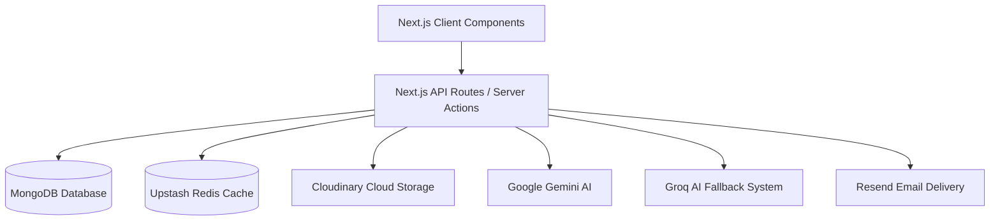

# ApplyIQ - Comprehensive Project Documentation

## Table of Contents
1. [Product Overview](#1-product-overview)
2. [Problem Statement](#2-problem-statement)
3. [Product Workflow](#3-product-workflow)
4. [System Architecture](#4-system-architecture)
5. [Tech Stack](#5-tech-stack)
6. [Third-Party APIs & Integrations](#6-third-party-apis--integrations)
7. [Project Structure](#7-project-structure)
8. [Backend Architecture](#8-backend-architecture)
9. [Frontend Architecture](#9-frontend-architecture)
10. [Features](#10-features)
11. [Database Design](#11-database-design)
12. [Security & Guardrails](#12-security--guardrails)
13. [Performance & Rate Limiting](#13-performance--rate-limiting)
14. [Development Workflow](#14-development-workflow)
15. [Future Roadmap](#15-future-roadmap)
16. [Conclusion](#16-conclusion)

---

## 1. Product Overview
**ApplyIQ** is a modern, AI-powered job search management and career coaching platform. It acts as a comprehensive "Command Center" for job seekers, combining the visual organization of a Kanban board with the deep, personalized insights of an AI career coach.

**Why are we building it?**
To eliminate the friction and chaos of the modern job search, shifting the paradigm from "spray and pray" to a highly targeted, data-driven approach.

**Vision & Long-Term Goals**
To become the definitive operating system for career growth, eventually expanding beyond job hunting into interview preparation, salary negotiation, and career pathing.

**Target Audience**
Professionals across all industries, primarily mid-to-senior level tech and knowledge workers who are applying to multiple roles concurrently.

**Core Value Proposition**
ApplyIQ brings structure to the chaos of job hunting. It scores your resume against specific job descriptions, tracks your pipeline visually, and tells you exactly what to say to land the interview—all in one place.

---

## 2. Problem Statement
**The Problem**
Job seekers traditionally rely on fragmented tools: spreadsheets for tracking, distinct folders for tailored resumes, word processors for cover letters, and basic folders for job descriptions. 

**Pain Points**
- **Disorganization:** Manually updating spreadsheets is tedious and often abandoned.
- **Generic Applications:** Tailoring resumes for every job is incredibly time-consuming, resulting in generic applications with low conversion rates.
- **Lack of Feedback:** Applicants often don't know *why* they were rejected.
- **Missed Opportunities:** Forgetting to follow up on cold leads or after interviews.

**Why ApplyIQ is Different**
ApplyIQ replaces the spreadsheet with a smart Kanban board and replaces the guesswork with AI. It actively works *for* the user by parsing JDs, extracting metadata, scoring match probability, generating tailored cover letters instantly, and protecting against AI hallucinations through strict evidence grounding.

---

## 3. Product Workflow

The complete user journey flows seamlessly through the following stages:

1. **User Authentication:**
   - User signs up via OAuth (Google) or standard credentials (Email/Password).
   - *Backend:* NextAuth handles session creation and issues a secure JWT cookie.

2. **Onboarding & Resume Import:**
   - User uploads their base PDF resume.
   - *Backend:* The PDF is uploaded to Cloudinary, and its raw text is extracted using `pdf-parse`. The text is saved as `resumeText` and an LLM extracts a structured schema saved as `resumeJson` in the `User` model.

3. **Dashboard (Command Center):**
   - User lands on a Kanban-style pipeline tracking roles across stages: *Saved*, *Applied*, *Interview*, *Offer*, *Rejected*.
   - Key metrics (Application Count, Streak, Response Rate) are calculated dynamically.

4. **Job Extraction & Creation:**
   - User pastes a Job Description URL or raw text into the "Add Job" modal.
   - *Backend:* The `/api/extract-jd` endpoint uses an LLM to intelligently extract the Company Name, Role Title, Location, and Salary, parsing up to 10,000 characters.
   - The job is added to the "Saved" column.

5. **AI-Powered Analysis & Tailoring:**
   - User clicks on a Job Card to view details. 
   - *Backend:* The `/api/jobs/[id]/analyze` endpoint compares the extracted JD against the user's `resumeText` (context window expanded to 12,000 characters to prevent truncation).
   - *Result:* The AI generates a `matchScore`, identifies `whatsStrong`, highlights the `biggestGap` (which is cross-checked server-side against the raw text to prevent hallucinations), lists `missingKeywords`, and generates actionable `aiCoachTips`.

6. **Cover Letter & Outreach Generation:**
   - Based on the AI match analysis, the user can generate highly specific networking messages and cover letters. To save tokens, these generative features utilize the compressed `resumeJson`.

7. **Resume Generation/Export (Future):**
   - User uses `@react-pdf/renderer` to visually generate and download a tailored PDF resume explicitly optimized for that specific job card.

---

## 4. System Architecture

ApplyIQ is built on a heavily decoupled, serverless-first Next.js architecture.



- **Client-Server Communication:** React Server Components (RSC) handle initial data fetching, while Client Components use Axios/Fetch for dynamic state mutations (e.g., drag-and-drop).
- **Data Flow:** Mongoose schemas enforce strict typings before writing to MongoDB. Zod schemas validate all LLM outputs before they touch the database.
- **State Management:** Zustand is used for global client state.
- **AI Request Flow:** NLP tasks utilize a custom Groq Model Fallback Waterfall (`llama-3.3-70b-versatile` falling back to `llama-3.1-8b-instant` on rate limits).
- **Rate Limiting:** Upstash Redis sits at the Edge to protect public routes and generative endpoints from abuse.

---

## 5. Tech Stack

### Core
- **Framework:** Next.js 16.1 (App Router)
- **Language:** TypeScript

### Frontend
- **UI Library:** React 19
- **Styling:** Tailwind CSS v4
- **Animations:** Framer Motion (used for layout transitions and the global `LogoLoader` branded suspense states).
- **State Management:** Zustand.
- **Drag & Drop:** `@hello-pangea/dnd` - Robust and accessible Kanban interactions.
- **Icons:** Lucide React.
- **Images:** Next.js `<Image />` component exclusively for LCP optimization.

### Backend & Infrastructure
- **Database:** MongoDB (via Mongoose 9.2).
- **Caching & Limiting:** Upstash Redis.
- **Authentication:** NextAuth.js (v5 Beta).
- **Transactional Emails:** Resend API.
- **File Parsing:** `pdf-parse` (Extracting text) and `@react-pdf/renderer`.
- **Storage:** Cloudinary.
- **Validation:** Zod (for validating unpredictable LLM JSON structures).

---

## 6. Third-Party APIs & Integrations

1. **Groq API (`groq-sdk`) & Google Gemini**
   - **Purpose:** Core intelligence layer. Used for JD extraction, deep reasoning (Resume vs. JD matching), and generating cover letters.
   - **Implementation:** Wrappers in `lib/grok.ts` utilize retry logic and model fallback capabilities to ensure 99.9% uptime despite strict free-tier rate limits.

2. **Upstash Redis**
   - **Purpose:** Edge rate-limiting (via Next.js Middleware) to protect authentication paths and heavy AI endpoints from spam.

3. **Cloudinary**
   - **Purpose:** Storing user avatars and uploaded PDF resumes securely.

4. **Resend**
   - **Purpose:** Transactional email delivery for account verification and updates.

---

## 7. Project Structure

```text
job-tracker/
├── app/                  # Next.js App Router root
│   ├── (auth)/           # Login, Register, Onboarding
│   ├── (dashboard)/      # Main Kanban board and job views
│   ├── api/              # Backend serverless routes
│   │   ├── auth/         # NextAuth configuration
│   │   ├── extract-jd/   # JD Metadata extraction
│   │   ├── jobs/         # CRUD & Generative Job routes
│   │   ├── resume/       # AI resume parsing, structuring, and ATS scoring
│   │   └── user/         # Profile management
├── components/           # React Components
│   ├── ai-coach/         # AI insight panels & match gauges
│   ├── board/            # Kanban columns & drag-and-drop logic
│   ├── ui/               # Reusable atomic UI (Buttons, LogoLoader, Modals)
├── lib/                  # Utilities & Configurations
│   ├── grok.ts           # AI wrapper with Fallback Waterfall
│   ├── groundingCheck.ts # Server-side logic to prevent LLM hallucinations
│   ├── redis.ts          # Upstash connection
│   └── store.ts          # Zustand global store
├── models/               # Mongoose Database Schemas
└── types/                # TypeScript interface definitions
```

---

## 8. Backend Architecture

**API Structure:** 
Follows RESTful principles implemented as Next.js Route Handlers (`route.ts`). All generative endpoints (Cover Letters, Analysis, Outreach) employ rigorous Zod validation and a 1-retry fallback system against malformed LLM outputs.

**Database Models:**
- **User Model:** Stores `resumeUrl`, `resumeText` (canonical source of truth), `resumeJson` (UI structured format), and highly detailed `atsDetails` (containing multi-metric sub-scores).
- **Job Model:** Embedded documents contain AI analysis (`matchScore`, `aiCoachTips`, `missingKeywords`) for blazing-fast reads.

**Caching Strategy:**
Analysis routes rely heavily on database caching. A `resumeFingerprint` is computed (length + slice) to ensure AI analysis only re-runs if the user's base resume has fundamentally changed.

---

## 9. Frontend Architecture

**Layouts & UI/UX:**
The app is split into Route Groups. The UI is built with a premium aesthetic featuring glassmorphism, subtle glows, and micro-interactions. Route transitions are masked by a custom branded `LogoLoader` component to ensure a seamless app-like experience.

**State Management & Performance:**
Generative buttons (like "Regenerate Cover Letter") are strictly removed to force reliance on cached states and protect API quotas. The application utilizes optimistic UI updates heavily for drag-and-drop pipeline management.

---

## 10. Features

### 1. Smart Kanban Board
- Visual pipeline tracking using `@hello-pangea/dnd`. State updates optimistically before syncing with MongoDB.

### 2. AI Resume Matching & Anti-Hallucination
- Gemini/Groq evaluates the `JobDescription` against the full `resumeText` (up to 12,000 characters). 
- **Grounding Check:** Before identifying a gap or missing keyword, the system runs `mightBeGrounded()` to verify semantic equivalence (e.g., MERN = MongoDB/React).

### 3. Rubric-Based ATS Scoring
- Resumes aren't just given arbitrary scores. The ATS checker calculates a score based on a strict 100-point rubric assessing: *Parseability, Contact Completeness, Quantified Achievements, Action Verb Strength, Keyword Coverage, and Section Completeness*.

### 4. Automated Metadata Extraction
- A user pastes a JD, and the system instantly parses up to 10,000 characters to auto-fill Job Titles, Companies, and compensation ranges.

---

## 11. Database Design

**User Collection (`users`)**
- 1:N relationship with Jobs.
- Holds both the raw text and JSON-structured versions of resumes.

**Job Collection (`jobs`)**
- Linked to `userId`.
- Denormalized schema: AI intelligence (scores, tips, generated messages) is embedded directly to prevent complex JOINs.

---

## 12. Security & Guardrails

- **Authentication:** Sessions managed via HttpOnly secure cookies.
- **LLM Output Safety:** Outputs are sanitized and run through `zod` schemas. If an LLM hallucinates an error in JSON formatting, the backend safely strips markdown code blocks and automatically retries.
- **Hallucination Prevention:** Downstream logic never trusts the LLM implicitly. Features like `missingKeywords` are cross-referenced with the base text file before rendering to the user.

---

## 13. Performance & Rate Limiting

- **Model Fallback Waterfall:** To navigate aggressive free-tier API quotas (like 30 RPM / 6,000 TPM), `lib/grok.ts` captures HTTP 429 status codes and instantly restarts inference using a lighter, distinct model bucket (`8b-instant`).
- **Token Trimming:** Context windows expand up to 12K chars for strict analytical tasks, but automatically condense down to structured `resumeJson` subsets for generic generative tasks (like drafting networking emails).
- **Edge Redis Limiting:** Public and generative routes are rate-limited via Upstash to protect API spend and ensure infrastructure stability.
- **Image Optimization:** All platform logos and assets are optimized using Next.js `next/image` to hit strict LCP (Largest Contentful Paint) targets.

---

## 14. Development Workflow

**Local Setup:**
1. Clone repo, `npm install`.
2. Copy `.env.example` to `.env.local` and add necessary keys (`MONGODB_URI`, `GROQ_API_KEY`, `UPSTASH_REDIS_REST_URL`, `RESEND_API_KEY`, etc.).
3. `npm run dev`.

**Linting & Standards:**
- Strict `eslint-config-next` enforced (all unused imports and `` tags removed).
- TypeScript strict mode enabled.

---

## 15. Future Roadmap

1. **In-Browser Resume Builder:** Drag-and-drop resume sections to instantly generate ATS-friendly PDFs.
2. **Chrome Extension:** Save jobs directly from LinkedIn/Indeed into the Kanban board with one click.
3. **Interview Prep Module:** Generate a mock interview chatbot to roleplay as the hiring manager based on the specific job description.
4. **Email Integration:** Connect via IMAP/Gmail API to automatically track interview scheduling and follow-ups.

---

## 16. Conclusion

ApplyIQ represents a shift from passive job hunting to active, AI-assisted career management. By combining a highly robust, secure Next.js/MongoDB backend with an ultra-polished, fluid Framer Motion frontend, the platform provides immense value to users. The codebase is strictly typed, modular, and optimized heavily for AI reliability, speed, and API cost-efficiency.
